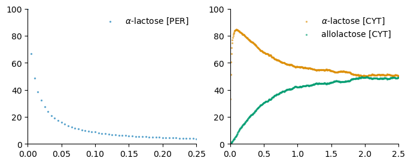
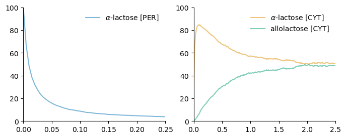
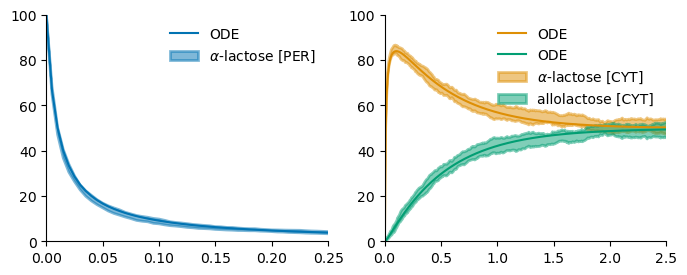

.. _Plotting-page:

Plotting
========

The simulation functions returns a dataframe in the case of deterministic simulations
and a dictionary in the case of stochastic simulations:

* The ``sims`` key of the dictionary is a list of dataframes, one for each simulation.
* The ``avrg`` key is a dataframe with the average of all simulations.
* The ``stdv`` key is a dataframe with the standard deviation of all simulations.

We provide three kind of plots: ``plot`` (continuous line), ``scatter``, and ``fill_between`` (avrg ± weight * stdv).

The ``plt_kws`` is a dictionary that aids to pass arguments to the matplotlib functions used to plot the results.

To plot an ``observable``, please execute one of the following functions:

   * dna: ``atlas_rbm.simulation.plot.dna(data, dna_name, plt_kws, **kwargs)``
   * rna: ``atlas_rbm.simulation.plot.rna(data, rna_name, plt_kws, **kwargs)``
   * complexes: ``atlas_rbm.simulation.plot.cplx(data, complex_name, location, plt_kws, **kwargs)``
   * metabolites: ``atlas_rbm.simulation.plot.metabolite(data, metabolite, location, plt_kws, **kwargs)``
   * proteins: ``atlas_rbm.simulation.plot.protein(data, protein_name, location, plt_kws, **kwargs)``

You could explore the available observables with ``model.observable.observables._map.keys()`` and use the name of the observable:

   * observable: ``atlas_rbm.simulation.plot.monomer(data, observable_name, plt_kws, **kwargs)``

.. literalinclude:: ./plotting1.py
       :language: python
       :encoding: latin-1
       :linenos:

.. literalinclude:: ./plotting2.py
       :language: python
       :encoding: latin-1
       :linenos:

.. note::
    *Atlas* produces automatically ``Observables`` for metabolites and other
    components. However, *Atlas* do not produce ``Observables`` for every possible component
    and the user could add observables with ``atlas_rbm.simulation.set_observable(model, pattern, alias)``.
